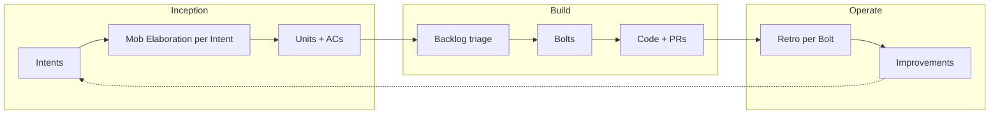

# CabinConnect — AI-DLC Implementation Plan

**Source:** [docs/solution/Requirements.md](../solution/Requirements.md)  
**Process:** [ai-dlc/README.md](../../ai-dlc/README.md) (Intent → Mob Elaboration → Units → Bolts → Code)  
**Status:** Planning — IMP-01 applied; no feature code until explicitly approved  
**Date:** 2026-05-29

---

## Overview

This plan maps the four MVP modules and non-functional requirements from `Requirements.md` into AI-DLC **Intents** and candidate **Units**. Final acceptance criteria are agreed during mob elaboration (one unit per turn), then recorded in `ai-dlc/ops/build/units/` and `ai-dlc/ops/build/backlog.md`.

**MVP delivery order** (from Requirements §MVP Scope):

1. Platform foundation (NFRs)
2. MyCabin (High) — foundation for other modules
3. Events (High)
4. Groceries — Pickup (High)
5. ToolShare (Medium)
6. Groceries — Delivery (Medium, phased)

---

## Product vs. repository artifacts

**IMP-01 complete** (2026-05-29). See [ai-dlc/ops/operate/improvements/2026-05-29-align-artifacts-with-requirements.md](../../ai-dlc/ops/operate/improvements/2026-05-29-align-artifacts-with-requirements.md).

Artifacts now align with `Requirements.md`: community-scoped multi-module product, updated glossary, architecture (including ADR-006), edge cases, mob prompts, and `CLAUDE.md` / `.cursorrules`.

---

## AI-DLC workflow

**Per intent:**

1. Write intent file: `ai-dlc/ops/inception/intents/YYYY-MM-DD-<slug>.md` ([template](../../ai-dlc/ops/inception/intents/_template.md))
2. Mob elaboration: [mob-elab-prompts.md](../../ai-dlc/skills/mob-elab-prompts.md) — one unit per turn → confirm name → ACs → edge cases
3. Final sign-off → unit files in `ai-dlc/ops/build/units/` + update `ai-dlc/ops/build/backlog.md`
4. Plan and execute Bolts from open units

**Recommended elaboration order:** Intent 1 → 2 → 3 → 4 → 5 → 6 (defer Intents 7 and 8 until MVP path is clear).

---

## Prerequisite (Improvement)

| ID | Name | Why |
|---|---|---|
| IMP-01 | Align AI-DLC artifacts with Requirements product | Prevents wrong domain language, edge cases, and architecture drift during all subsequent work |

---

## Intents and units

Units below are **candidates for mob elaboration**. Final Given/When/Then ACs are agreed in elaboration sessions.

---

### Intent 1: `platform-community-tenancy`

| Field | Content |
|---|---|
| **What** | Every user and record belongs to a resort/community; the system never leaks data across communities. |
| **Why** | NF-03, EV-05 — multi-resort Norway scale with isolation. |
| **Success** | A user in Resort A cannot see Resort B data at API or DB (RLS) level. |
| **Req trace** | NF-03, EV-05 |

| Unit | One-sentence purpose | Req | Depends on |
|---|---|---|---|
| `community-entity-schema` | Persist communities (resorts) with stable identity. | NF-03 | — |
| `user-community-membership` | Link authenticated users to one or more communities with a primary context. | NF-03 | `community-entity-schema` |
| `api-community-context` | Resolve and enforce active community on every API request. | NF-03, EV-05 | `user-community-membership` |
| `rls-community-policies` | RLS on all tenant tables restricts rows to the user's community. | NF-03 | `community-entity-schema` |
| `cross-community-access-denied` | Negative paths: wrong community ID, tampered context → 403/404. | NF-03 | `api-community-context`, `rls-community-policies` |

**Elaboration edge cases:** membership changes mid-session; user in multiple communities; admin cross-community (likely out of scope).

---

### Intent 2: `platform-auth-roles`

| Field | Content |
|---|---|
| **What** | Supabase Auth with role-aware authorization for all mutating actions. |
| **Why** | NF-05; each module needs distinct actors (Owner, Resident, Admin, Volunteer, limited Guest). |
| **Success** | Unauthenticated mutation → 401; wrong role → 403; allowed public reads work without login where defined. |
| **Req trace** | NF-05 |

| Unit | One-sentence purpose | Req | Depends on |
|---|---|---|---|
| `jwt-validation-api` | API validates Supabase JWT (JWKS); identity available to handlers. | NF-05 | Scaffold may exist |
| `role-model-and-assignment` | Roles: Cabin Owner, Resident, Admin, Volunteer (+ limited guest access pattern). | NF-05 | `user-community-membership` |
| `authorize-mutations-by-role` | Policy layer: only permitted roles can mutate per resource type. | NF-05 | `role-model-and-assignment` |
| `public-read-endpoints-policy` | Explicit allowlist for browse-without-auth (e.g. published events, guest instruction links). | NF-05 | Per module units |
| `auth-session-refresh-frontend` | Frontend refreshes session; API returns 401 on expired JWT. | NF-05 | `jwt-validation-api` |

---

### Intent 3: `platform-mobile-cloud-baseline`

| Field | Content |
|---|---|
| **What** | Deployable, mobile-first shell on shared cloud infrastructure. |
| **Why** | NF-01, NF-02, NF-04, NF-06. |
| **Success** | App usable on mobile; API + SPA deployable; config supports multiple resorts without redeploy. |
| **Req trace** | NF-01, NF-02, NF-04, NF-06 |

| Unit | One-sentence purpose | Req | Depends on |
|---|---|---|---|
| `responsive-app-shell` | Mobile-first layout, navigation, touch-friendly patterns. | NF-04 | — |
| `ci-cd-api-and-spa` | Build, test, deploy pipeline for .NET API + React SPA. | NF-01 | — |
| `multi-resort-configuration` | Per-environment config for multiple communities (no secrets in repo). | NF-02, NF-06 | `community-entity-schema` |
| `operational-health-endpoints` | Health/readiness for hosting and monitoring. | NF-01 | May exist |
| `low-cost-hosting-runbook` | Document/deploy pattern for shared hosting (static SPA + API). | NF-06 | `ci-cd-api-and-spa` |

---

### Intent 4: `mycabin-owner-hub`

| Field | Content |
|---|---|
| **What** | Cabin owners manage profile, operational info, maintenance, costs, and guest instructions. |
| **Why** | Core value; foundation for other modules (MC-01–MC-06). |
| **Success** | Owner can run their cabin digitally; guests can open instructions without a full account. |
| **MVP priority** | High |
| **Req trace** | MC-01 … MC-06 |

| Unit | One-sentence purpose | Req | Depends on |
|---|---|---|---|
| `cabin-profile-create` | Owner creates cabin profile (name, location, capacity, amenities). | MC-01 | Platform auth + tenancy |
| `cabin-profile-update` | Owner updates their cabin profile fields. | MC-01 | `cabin-profile-create` |
| `cabin-operational-info` | Store/update access codes, emergency contacts, rules (secured). | MC-02 | `cabin-profile-create` |
| `maintenance-task-create` | Log maintenance task with initial status. | MC-03 | `cabin-profile-create` |
| `maintenance-task-status-update` | Change task status; append history. | MC-03 | `maintenance-task-create` |
| `maintenance-history-view` | Owner views task list and status/history timeline. | MC-03 | `maintenance-task-create` |
| `ownership-cost-input` | Owner enters cost components (utilities, maintenance, fees). | MC-04 | `cabin-profile-create` |
| `ownership-cost-estimate-view` | Calculate and display estimated ownership costs. | MC-04 | `ownership-cost-input` |
| `visitor-instructions-create` | Owner creates instruction set for invited guests. | MC-05 | `cabin-profile-create` |
| `visitor-instructions-share` | Generate shareable access for a specific guest/visit. | MC-05 | `visitor-instructions-create` |
| `guest-instructions-public-access` | Guest opens instructions via limited token/link without full account. | MC-06 | `visitor-instructions-share`, `public-read-endpoints-policy` |

**Out of scope (intent level):** booking/rental of cabins to strangers; payment for stays.

---

### Intent 5: `community-events`

| Field | Content |
|---|---|
| **What** | Admins publish community events; residents discover and register; admins manage attendees and updates. |
| **Why** | High engagement, low complexity (EV-01–EV-05). |
| **Success** | Residents only see their community's events; admins can run an event end-to-end. |
| **MVP priority** | High |
| **Req trace** | EV-01 … EV-05 |

| Unit | One-sentence purpose | Req | Depends on |
|---|---|---|---|
| `event-create-draft` | Admin creates event (draft) with date, category, details. | EV-01 | Platform auth + tenancy |
| `event-edit` | Admin edits draft or published event fields. | EV-01 | `event-create-draft` |
| `event-publish` | Admin publishes event → visible to community residents. | EV-01 | `event-create-draft` |
| `event-browse-filter` | Resident browses upcoming events by date and category. | EV-02 | `event-publish`, `public-read-endpoints-policy` |
| `event-register-interest` | Resident registers interest or attendance. | EV-03 | `event-publish` |
| `event-attendee-list` | Admin views/manages attendee list for an event. | EV-04 | `event-register-interest` |
| `event-admin-updates` | Admin sends updates to registered attendees. | EV-04 | `event-attendee-list` |
| `event-community-scope-enforcement` | Events only returned for caller's community. | EV-05 | `api-community-context` |

---

### Intent 6: `grocery-pickup` (MVP — no volunteer delivery)

| Field | Content |
|---|---|
| **What** | Owners browse RIMA catalog, schedule pickup orders aligned to travel, track status, receive notifications. |
| **Why** | High-demand monetization path; delivery deferred (GR-01, GR-02, GR-05, GR-06). |
| **Success** | End-to-end pickup order with status visibility and notifications. |
| **MVP priority** | High (pickup only) |
| **Req trace** | GR-01, GR-02, GR-05, GR-06 |

| Unit | One-sentence purpose | Req | Depends on |
|---|---|---|---|
| `rima-catalog-integration` | Integration adapter: browse products from RIMA (single supplier). | GR-01 | Platform auth + tenancy |
| `grocery-catalog-browse` | Owner browses catalog in-app (backed by integration). | GR-01 | `rima-catalog-integration` |
| `pickup-order-place` | Owner places pickup order with line items. | GR-02 | `grocery-catalog-browse` |
| `pickup-schedule-to-journey` | Owner schedules pickup time tied to cabin journey/arrival. | GR-02 | `pickup-order-place` |
| `order-status-lifecycle` | Status transitions: placed → ready → (in transit if needed) → delivered/picked up. | GR-05 | `pickup-order-place` |
| `order-status-owner-view` | Owner views current order status and history. | GR-05 | `order-status-lifecycle` |
| `order-status-notifications` | Owner notified on status changes (channel TBD in elaboration). | GR-06 | `order-status-lifecycle` |

**Intent out of scope:** GR-03, GR-04 (see Intent 7).

---

### Intent 7: `grocery-volunteer-delivery` (Phase 2 — Deferred)

| Field | Content |
|---|---|
| **What** | Volunteer carriers and doorstep delivery for grocery orders. |
| **Why** | Demanded but complex; phase after pickup (Requirements note). |
| **Status** | `Deferred` until pickup Bolt completes |
| **Req trace** | GR-03, GR-04 |

| Unit | One-sentence purpose | Req | Depends on |
|---|---|---|---|
| `volunteer-carrier-registration` | User registers as delivery volunteer in community. | GR-04 | Intent 6 complete |
| `volunteer-accept-delivery-request` | Volunteer accepts an open delivery request. | GR-04 | `volunteer-carrier-registration` |
| `doorstep-delivery-order` | Owner places delivery (not pickup) order to cabin. | GR-03 | Intent 6 catalog/orders |
| `delivery-status-in-tracking` | Delivery states appear in owner tracking (extends GR-05). | GR-03, GR-05 | `order-status-lifecycle` |

---

### Intent 8: `toolshare`

| Field | Content |
|---|---|
| **What** | Community tool lending/renting with requests, approval, status, and history. |
| **Why** | Community value; needs user density (TS-01–TS-06). |
| **MVP priority** | Medium |
| **Req trace** | TS-01 … TS-06 |

| Unit | One-sentence purpose | Req | Depends on |
|---|---|---|---|
| `tool-listing-create` | Owner lists tool/equipment for lend or rent. | TS-01 | Platform auth + tenancy |
| `tool-listing-update` | Owner edits listing (terms, availability rules). | TS-01 | `tool-listing-create` |
| `tool-community-browse` | Owner browses tools available in their community. | TS-02 | `tool-listing-create` |
| `tool-borrow-request` | Request borrow/rent for a specified period. | TS-03 | `tool-listing-create` |
| `tool-request-approve-decline` | Listing owner approves or declines request. | TS-04 | `tool-borrow-request` |
| `tool-status-display` | Both parties see status: available, reserved, on loan. | TS-05 | `tool-borrow-request`, `tool-request-approve-decline` |
| `tool-loan-history-record` | System records completed loans for accountability. | TS-06 | `tool-status-display` |

**Elaboration edge cases:** overlapping requests for same tool/dates; decline after approve; cancel mid-loan.

---

## Requirements traceability

| Req ID | Intent | Unit(s) |
|---|---|---|
| MC-01 | mycabin-owner-hub | `cabin-profile-create`, `cabin-profile-update` |
| MC-02 | mycabin-owner-hub | `cabin-operational-info` |
| MC-03 | mycabin-owner-hub | `maintenance-task-*`, `maintenance-history-view` |
| MC-04 | mycabin-owner-hub | `ownership-cost-*` |
| MC-05 | mycabin-owner-hub | `visitor-instructions-*` |
| MC-06 | mycabin-owner-hub | `guest-instructions-public-access` |
| EV-01 | community-events | `event-create-draft`, `event-edit`, `event-publish` |
| EV-02 | community-events | `event-browse-filter` |
| EV-03 | community-events | `event-register-interest` |
| EV-04 | community-events | `event-attendee-list`, `event-admin-updates` |
| EV-05 | community-events + platform | `event-community-scope-enforcement`, tenancy units |
| GR-01 | grocery-pickup | `rima-catalog-integration`, `grocery-catalog-browse` |
| GR-02 | grocery-pickup | `pickup-order-place`, `pickup-schedule-to-journey` |
| GR-03 | grocery-volunteer-delivery | `doorstep-delivery-order` |
| GR-04 | grocery-volunteer-delivery | `volunteer-*` |
| GR-05 | grocery-pickup (+ phase 2) | `order-status-*` |
| GR-06 | grocery-pickup | `order-status-notifications` |
| TS-01–TS-06 | toolshare | All toolshare units |
| NF-01–NF-06 | platform intents | See platform units above |

---

## Suggested Bolts

| Bolt | Intents / units | Outcome |
|---|---|---|
| **Bolt 00** | ~~IMP-01~~ + create `ai-dlc/ops/build/backlog.md` | ~~Aligned glossary~~ done; create backlog |
| **Bolt 01** | Platform: tenancy + auth + health/CI baseline | Secure multi-tenant API shell |
| **Bolt 02** | `mycabin-owner-hub` | Owners manage cabin + guest instructions |
| **Bolt 03** | `community-events` | Events live for one community |
| **Bolt 04** | `grocery-pickup` | RIMA pickup flow end-to-end |
| **Bolt 05** | `toolshare` | Tool listing and loan flow |
| **Bolt 06** | `grocery-volunteer-delivery` | Delivery + volunteers (deferred) |

Within each Bolt, order units by dependency (schema → API → UI → notifications).

---

## Edge cases (to add during elaboration)

Edge cases in `ai-dlc/guidelines/edge-cases.md` (applied in IMP-01):

| ID | Scenario | Modules |
|---|---|---|
| EC-COM-01 | User attempts access with wrong `community_id` | Platform, Events |
| EC-COM-02 | User removed from community while session active | Platform |
| EC-MC-01 | Guest instruction link expired or revoked | MyCabin |
| EC-MC-02 | Operational info (access codes) exposed to wrong role | MyCabin |
| EC-EV-01 | Register for full event / past event | Events |
| EC-GR-01 | RIMA unavailable / timeout during browse or submit | Groceries |
| EC-GR-02 | Pickup time in the past | Groceries |
| EC-GR-03 | Two volunteers accept same delivery (phase 2) | Groceries |
| EC-TS-01 | Overlapping borrow requests for same tool/dates | ToolShare |
| EC-TS-02 | Owner declines after borrower assumed approved | ToolShare |

---

## Open questions (resolve in elaboration)

| Topic | Question |
|---|---|
| Community membership | One primary community per user vs. multiple active contexts? |
| Admin role | Global per resort only, or separate “events admin” vs. “platform admin”? |
| MC-06 guest access | Magic link, OTP email, or time-boxed token — retention and revocation? |
| GR-06 notifications | Push, email, SMS, in-app only? |
| RIMA integration | Real API vs. stub for MVP; sandbox credentials |
| Monetization | Called out in MVP notes but no requirements — out of scope unless added |

---

## Unit count summary

| Intent | Units |
|---|---|
| platform-community-tenancy | 5 |
| platform-auth-roles | 5 |
| platform-mobile-cloud-baseline | 5 |
| mycabin-owner-hub | 11 |
| community-events | 8 |
| grocery-pickup | 7 |
| grocery-volunteer-delivery | 4 (deferred) |
| toolshare | 7 |
| **Total** | **52** (+ IMP-01) |

---

## Intent index (for `ai-dlc/ops/inception/intents/README.md`)

| Intent slug | Status | Date | MVP |
|---|---|---|---|
| `platform-community-tenancy` | Draft | — | — |
| `platform-auth-roles` | Draft | — | — |
| `platform-mobile-cloud-baseline` | Draft | — | — |
| `mycabin-owner-hub` | Draft | — | High |
| `community-events` | Draft | — | High |
| `grocery-pickup` | Draft | — | High |
| `grocery-volunteer-delivery` | Deferred | — | Medium |
| `toolshare` | Draft | — | Medium |

---

## Next steps

1. Approve this plan (or request edits).
2. ~~Run **IMP-01** (artifact alignment).~~ **Done.**
3. Write Intent 1 file and run mob elaboration for `platform-community-tenancy`.
4. Create backlog and unit files after each intent sign-off.
5. Plan **Bolt 01** when platform units are `Open` in the backlog.

**No code, migrations, or intent/unit files under `ai-dlc/ops/` should be created until explicitly requested.**
